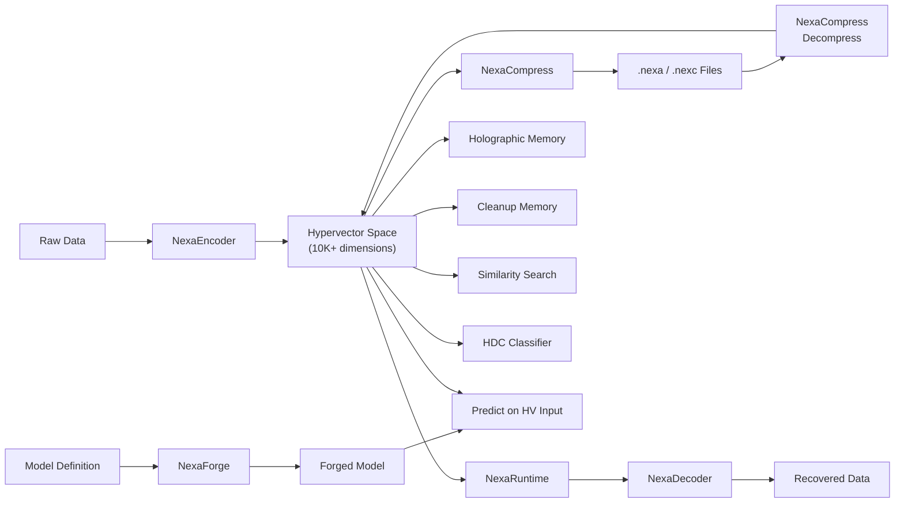
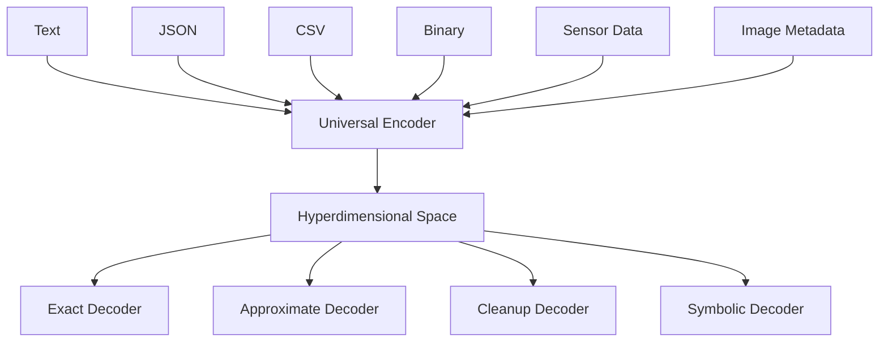
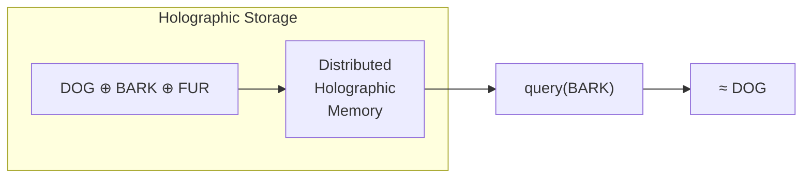
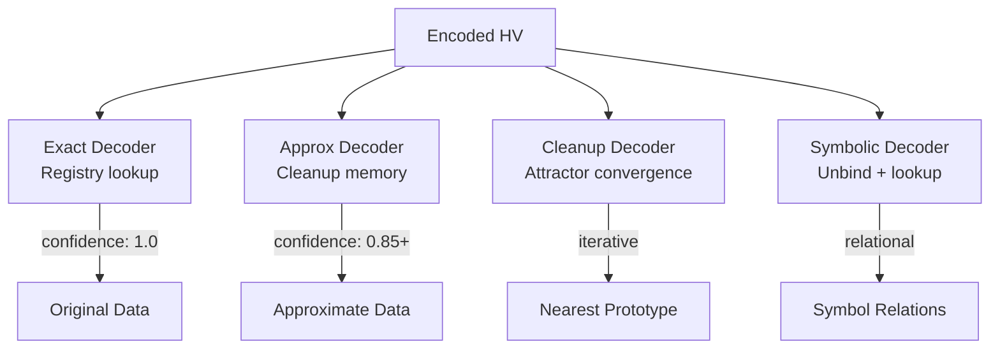
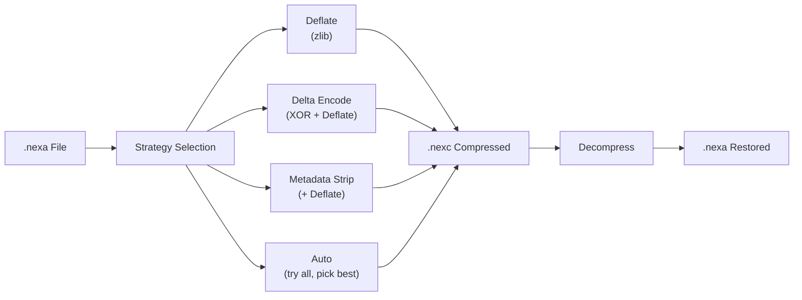
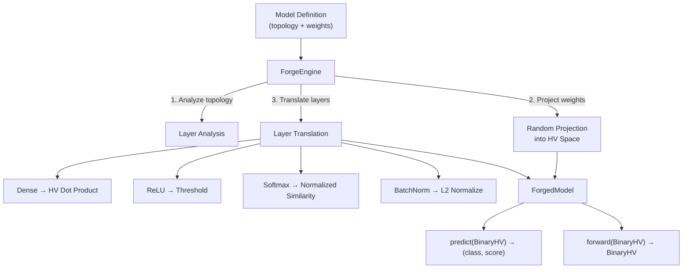
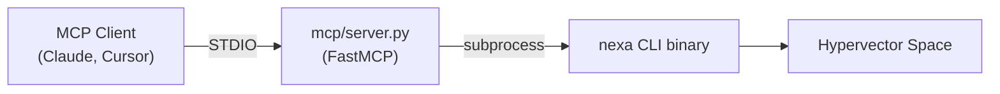
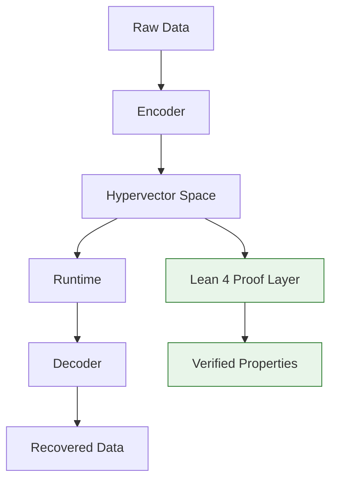
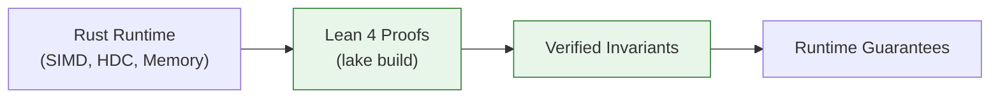
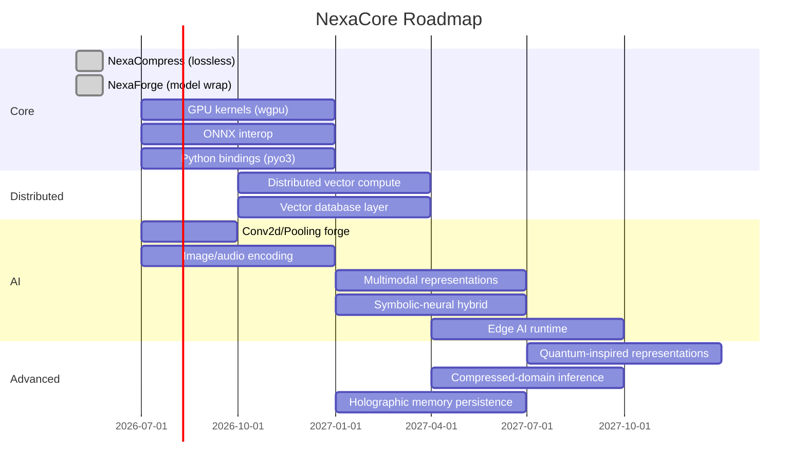

# NexaCore

**A high-performance universal representation runtime built in Rust.**

NexaCore is a production-grade compute engine that transforms any data into high-dimensional holographic hypervectors and performs computation directly in encoded space. It implements hyperdimensional computing (HDC), holographic reduced representations (HRR), vector symbolic architectures (VSA), and sparse distributed memory (SDM) — enabling lightweight, corruption-resilient AI inference without tensor pipelines.

> **"Encode once. Compute anywhere."**

```
┌─────────────────────────────────────────────────────────────┐
│                        NexaCore                             │
│                                                             │
│   Raw Data → Encoder → Hypervector Space → Runtime          │
│                              ↓                              │
│                         Decoder → Recovered Data            │
│                                                             │
│   • LLVM for representations                                │
│   • An operating system for vector cognition                │
│   • Infrastructure for next-generation AI systems            │
└─────────────────────────────────────────────────────────────┘
```

---

## Architecture





---

## Core Concepts

### Hyperdimensional Computing (HDC)

Data is represented as high-dimensional vectors (1K–100K+ dimensions). At these dimensions, random vectors are *quasi-orthogonal* — almost certainly dissimilar — which gives us a massive address space for symbolic representation.

**Core operations:**

| Operation | Binary | Bipolar | Description |
|-----------|--------|---------|-------------|
| **Bind** | XOR | Element-wise multiply | Associate two concepts |
| **Bundle** | Majority rule | Sum + threshold | Superimpose multiple concepts |
| **Permute** | Circular shift | Circular shift | Encode sequence/position |
| **Similarity** | Hamming distance | Cosine similarity | Measure relatedness |

```rust
use nexa_core::BinaryHV;

// Create random hypervectors (10K dimensions)
let apple = BinaryHV::random(10_000, 42)?;
let red   = BinaryHV::random(10_000, 43)?;

// Bind: associate APPLE with RED
let apple_red = apple.bind(&red)?;

// Unbind: recover RED from the association
let recovered = apple_red.unbind(&apple)?;
assert_eq!(recovered, red);

// Random vectors are quasi-orthogonal (~0.5 similarity)
let banana = BinaryHV::random(10_000, 44)?;
let sim = apple.hamming_similarity(&banana)?;
assert!((sim - 0.5).abs() < 0.05);
```

### Holographic Memory

Information is stored *holographically* — distributed across the entire vector. No single region contains all information. This provides:

- **Corruption resilience** — partial data loss permits recovery
- **Associative recall** — retrieve by similarity, not exact address
- **Graceful degradation** — capacity overload reduces quality, not crashes



```rust
use nexa_holography::HolographicStore;
use nexa_core::RealHV;

let mut store = HolographicStore::new(256)?;

let dog  = RealHV::random_normal(256, 1)?;
let bark = RealHV::random_normal(256, 2)?;

// Store holographically (via circular convolution)
store.store(&dog, &bark)?;

// Retrieve: query with DOG → get back ≈ BARK
let retrieved = store.retrieve(&dog)?;
let similarity = bark.cosine_similarity(&retrieved)?;
assert!(similarity > 0.5);
```

### Homomorphic-style Transformations

NexaCore supports **representational homomorphism** — structure-preserving transforms where operations in raw space map to cheaper operations in encoded space.

```
f(A ⊗ B) = f(A) ⊕ f(B)
```

This is NOT cryptographic homomorphic encryption. It's the mathematical property that composition is preserved under transformation — enabling direct computation on encoded representations.

```rust
use nexa_runtime::HomomorphicOps;

// Permutation is homomorphic over XOR binding
let similarity = HomomorphicOps::verify_binding_homomorphism(
    &a, &b,
    |v| v.permute(5)  // permutation as transform
);
assert!(similarity > 0.99);
```

### Cleanup Memory & SDM

**Cleanup memory** stores "clean" prototype vectors and restores noisy queries to their nearest stable state — like an error-correcting attractor network.

**Sparse Distributed Memory (SDM)** implements Kanerva's model: distributed storage with address-based activation, graceful capacity degradation, and content-addressable recall.

```rust
use nexa_memory::CleanupMemory;
use nexa_core::BinaryHV;

let mut mem = CleanupMemory::new(10_000)?;

// Store clean prototypes
let dog = BinaryHV::random(10_000, 1)?;
mem.store("dog", dog.clone())?;

// Query with noisy version (10% corruption)
let noisy = dog.corrupt(0.10, 99);
let result = mem.query(&noisy)?.unwrap();
assert_eq!(result.label, "dog");
assert!(result.similarity > 0.85);
```

---

## Project Structure

```
crates/
├── nexa-core/        Core hypervector engine, SIMD ops, .nexa format
├── nexa-hdc/         HDC operations: codebooks, sequence/set encoding
├── nexa-holography/  Holographic reduced representations, FFT convolution
├── nexa-memory/      Cleanup memory, SDM, associative recall
├── nexa-encoder/     Universal encoder (text, JSON, CSV, binary)
├── nexa-decoder/     Exact/approximate/cleanup/symbolic decoders
├── nexa-runtime/     Classifiers, search, anomaly detection, clustering
├── nexa-topology/    Model architecture analysis, graph encoding
├── nexa-compress/    NexaCompress — lossless compression for HV data
├── nexa-forge/       NexaForge — universal model wrapping engine
├── nexa-proof/       Formal verification bridge (Lean 4 → Rust)
├── nexa-cli/         Command-line interface
├── nexa-bench/       Criterion benchmarks
└── nexa-python/      Python bindings (PyO3)

proofs/
├── lakefile.toml     Lake project configuration
├── lean-toolchain    Lean 4.29.1
└── Nexa/
    ├── HyperVector.lean     Core types
    ├── Binding.lean         XOR algebra proofs
    ├── Permutation.lean     Permutation invariants
    ├── Similarity.lean      Metric properties
    ├── Encoding.lean        Roundtrip correctness
    ├── Decoding.lean        Decoder properties
    ├── CleanupMemory.lean   Recovery proofs
    ├── Homomorphism.lean    Structure preservation
    └── RecoveryBounds.lean  Corruption tolerance
```

---

## Decoder Architecture

NexaCore supports **bidirectional representational flow** with four decoder modes:



### Exact Decoder
Deterministic round-trip reconstruction via encoding registry.

```rust
let mut encoder = NexaEncoder::new(10_000, 42);
let encoded = encoder.encode_text("apple")?;

let decoder = ExactDecoder::from_encoder(&encoder);
let result = decoder.decode(&encoded)?;
assert_eq!(String::from_utf8(result.data)?, "apple");
```

### Approximate Decoder
Tolerates corruption via cleanup-memory-based nearest-match retrieval.

```rust
let corrupted = CorruptionEngine::corrupt(&encoded, 0.15, 99);
let result = approx_decoder.decode(&corrupted)?.unwrap();
assert!(result.similarity > 0.80);
```

### Cleanup Decoder
Iterative attractor convergence — repeatedly queries cleanup memory until the result stabilizes.

```rust
let noisy = original.corrupt(0.20, 99);
let result = cleanup_decoder.restore_iterative(&noisy, 10)?;
assert_eq!(result.unwrap().label, "dog");
```

### Symbolic Decoder
Recovers symbolic relationships from bound vectors.

```rust
// DOG ⊕ BARK
let relation = dog_hv.bind(&bark_hv)?;

// Decode: unbind with DOG → find BARK
let result = symbolic.decode_binding(&relation, &dog_hv);
assert_eq!(result.unwrap().symbol, "BARK");
```

---

## Corruption Resilience

Holographic representations degrade gracefully under corruption:

```
Corruption Rate │ Hamming Similarity │ Recovery
────────────────┼────────────────────┼──────────
     5%         │      ~0.95         │ Exact
    10%         │      ~0.90         │ Exact
    15%         │      ~0.85         │ Approximate
    20%         │      ~0.80         │ Approximate
    30%         │      ~0.70         │ Cleanup needed
    50%         │      ~0.50         │ Near random
```

```rust
let original = BinaryHV::random(10_000, 42)?;

for rate in [0.05, 0.10, 0.15, 0.20, 0.30] {
    let corrupted = original.corrupt(rate, 99);
    let fidelity = CorruptionEngine::measure_fidelity(&original, &corrupted)?;
    println!("{:.0}% corruption → {:.2} fidelity", rate * 100.0, fidelity);
}
```

Output:
```
5% corruption → 0.95 fidelity
10% corruption → 0.90 fidelity
15% corruption → 0.85 fidelity
20% corruption → 0.80 fidelity
30% corruption → 0.70 fidelity
```

---

## Topology Analysis

Encode neural network architectures into hypervector space for structural comparison:

```rust
use nexa_topology::*;

let mlp_small = build_simple_mlp(&[784, 128, 10], "relu");
let mlp_large = build_simple_mlp(&[784, 512, 256, 128, 10], "relu");

let mut analyzer = TopologyAnalyzer::new(1000, 42);
let sim = analyzer.similarity(&mlp_small, &mlp_large)?;
println!("Architecture similarity: {:.3}", sim);
// Output: Architecture similarity: 0.523
```

---

## NexaCompress

Lossless compression engine for `.nexa` files and hypervector data. Multiple strategies optimised for binary hypervectors:

| Strategy | Description | Best for |
|----------|-------------|----------|
| **Deflate** | General-purpose zlib compression | All data types |
| **Delta** | XOR successive vectors → compress low-entropy deltas | Batches of related vectors |
| **MetadataStrip** | Remove redundant `original_data` from records + deflate | Reducing metadata bloat |
| **Auto** | Try all strategies, keep the smallest | Default — always picks the best |



### Rust API

```rust
use nexa_compress::*;

// Compress raw bytes
let data = b"hello nexacore compression test!";
let compressed = compress(data, Strategy::Deflate)?;
let restored = decompress(&compressed)?;
assert_eq!(restored, data);

// Delta-encode a batch of similar vectors
let vectors = vec![vec![0u8; 1250], vec![1u8; 1250], vec![2u8; 1250]];
let cd = compress_vectors(&vectors, Strategy::Delta)?;
let recovered = decompress_vectors(&cd)?;
assert_eq!(recovered, vectors);

// Compress a .nexa file (auto picks best strategy)
let stats = compress_nexa_file(
    Path::new("encoded.nexa"),
    Path::new("encoded.nexc"),
    Strategy::Auto,
)?;
println!("{}", stats);
// Strategy: delta
//   Original:   12580 bytes
//   Compressed: 3421 bytes
//   Ratio:      3.68x
//   Bits/byte:  2.175
//   Time:       1.2ms

// Decompress back to .nexa
decompress_nexa_file(
    Path::new("encoded.nexc"),
    Path::new("restored.nexa"),
)?;
```

### CLI Usage

```bash
# Compress a .nexa file (auto strategy)
nexa compress encoded.nexa -o compressed.nexc

# Compress with a specific strategy
nexa compress encoded.nexa -o compressed.nexc --strategy delta

# Decompress back to .nexa
nexa decompress compressed.nexc -o restored.nexa
```

---

## NexaForge

Universal model wrapping engine that translates neural network models to operate directly on hypervector-encoded data **without retraining**.



### Layer Translation Table

| Original Layer | HV Translation | How It Works |
|----------------|----------------|-------------|
| **Dense** (fully connected) | HV dot product | Weight rows projected into HV space via Rademacher ±1 random projection |
| **ReLU** | Element-wise threshold | Values > 0 pass through, else 0 |
| **Sigmoid** | Scaled mapping | `1 / (1 + exp(-x))` in real-valued HV space |
| **Softmax** | Normalized exponents | Standard softmax on HV-space activations |
| **BatchNorm** | L2 normalisation | Normalise real-valued vector to unit length |
| **Dropout** | Identity | No-op at inference time |
| **Flatten** | Passthrough | HVs are already flat vectors |

### Rust API

```rust
use nexa_forge::*;

// Define a simple MLP: 784 → 128 → 10
let def = ModelDefinition::simple_mlp("digit_classifier", &[784, 128, 10], "relu");

// Or define manually with custom weights
let def = ModelDefinition {
    graph: my_model_graph,
    weights: hashmap! {
        "dense_0" => WeightMatrix::new(128, 784, trained_weights_0),
        "dense_1" => WeightMatrix::new(10, 128, trained_weights_1),
    },
    biases: hashmap! {
        "dense_0" => BiasVector { data: bias_0 },
        "dense_1" => BiasVector { data: bias_1 },
    },
    class_labels: vec!["0".into(), "1".into(), /* ... */ "9".into()],
};

// Forge the model
let config = ForgeConfig {
    dim: 10_000,
    seed: 42,
    bipolar_projection: true,
};

let (forged_model, report) = ForgeEngine::forge(&def, &config)?;
println!("{}", report);
// NexaForge Report
//   Model:             MLP
//   Original layers:   3
//   Forged layers:     4
//   HV dimension:      10000
//   Total weights:     101770
//   Projected weights: 1380000
//   Classes:           10
//   Forge time:        45.2ms

// Run inference on encoded data
let predictions = forged_model.predict(&encoded_input)?;
for (class, score) in &predictions {
    println!("{class}: {score:.4}");
}
// class_3: 0.2841
// class_7: 0.1523
// class_1: 0.1102
// ...
```

### CLI Usage

```bash
# Forge a model from a JSON definition
nexa forge model_definition.json --dim 10000

# Run prediction on encoded data
nexa forge-predict model_definition.json encoded_input.nexa --dim 10000
```

### JSON Model Definition Format

```json
{
  "graph": {
    "name": "MLP",
    "layers": [
      {"id": 0, "name": "input", "layer_type": {"Input": {"shape": [784]}}, "connections": []},
      {"id": 1, "name": "dense_0", "layer_type": {"Dense": {"units": 128, "activation": "relu"}}, "connections": [2]},
      {"id": 2, "name": "dense_1", "layer_type": {"Dense": {"units": 10, "activation": "linear"}}, "connections": []}
    ]
  },
  "weights": {
    "dense_0": {"rows": 128, "cols": 784, "data": [0.01, -0.02, ...]},
    "dense_1": {"rows": 10, "cols": 128, "data": [0.03, 0.01, ...]}
  },
  "biases": {
    "dense_0": {"data": [0.0, 0.0, ...]},
    "dense_1": {"data": [0.0, 0.0, ...]}
  },
  "class_labels": ["0", "1", "2", "3", "4", "5", "6", "7", "8", "9"]
}
```

---

## .nexa File Format

Memory-mappable binary format for persistent hypervector storage:

```
┌──────────────────────────────┐
│ Magic: "NEXA" (4 bytes)      │
│ Version: u16                 │
│ Flags: u16                   │
│ Dimension: u32               │
│ Vector Count: u32            │
│ Encoding Type: u8            │
│ Checksum Algo: u8            │
│ Header Checksum: u32 (CRC32) │
├──────────────────────────────┤
│ Metadata Length: u32         │
│ Metadata: JSON (variable)    │
├──────────────────────────────┤
│ Vector Data (aligned blocks) │
├──────────────────────────────┤
│ Index Table                  │
│ Footer Checksum: u32 (CRC32) │
│ Magic End: "AXEN" (4 bytes)  │
└──────────────────────────────┘
```

---

## CLI Usage

```bash
# Encode a file
nexa encode input.txt -o encoded.nexa --dim 10000

# Inspect a .nexa file
nexa inspect encoded.nexa

# Compute similarity between two encoded files
nexa similarity a.nexa b.nexa

# Run benchmarks
nexa benchmark --dim 10000

# Encode model topology
nexa topology model.json

# Compress a .nexa file (NexaCompress)
nexa compress encoded.nexa -o compressed.nexc --strategy auto

# Decompress back to .nexa
nexa decompress compressed.nexc -o restored.nexa

# Forge a model for encoded-space inference (NexaForge)
nexa forge model_definition.json --dim 10000

# Run inference with a forged model
nexa forge-predict model_definition.json encoded_input.nexa --dim 10000
```

### Example: Encode and Inspect

```
$ nexa encode README.md -o readme.nexa
NexaCore Encoder
  Input:     README.md (8432 bytes)
  Type:      Text
  Dimension: 10000
  Output:    readme.nexa
  Status:    ✓ Encoded successfully

$ nexa inspect readme.nexa
NexaCore Inspector
  Magic:        NEXA ✓
  Version:      1
  Dimension:    10000
  Vectors:      1
  Encoding:     0 (default)
  Checksum:     ✓ Valid
```

### Example: Benchmark

```
$ nexa benchmark --dim 10000
NexaCore Benchmark (dim=10000)
  XOR Binding:      1000 ops in 2.3ms   (434.8K ops/sec)
  Hamming Distance: 1000 ops in 1.8ms   (555.6K ops/sec)
  Bundle (10 vecs): 100 ops in 15.2ms   (6.6K ops/sec)
```

## MCP Server

NexaCore ships as an [MCP](https://modelcontextprotocol.io/) server, letting any MCP-compatible client (Claude Desktop, Cursor, etc.) use hyperdimensional computing tools directly.

### Available Tools

| Tool | Description |
|------|-------------|
| `encode` | Encode text/JSON/CSV into hypervector space |
| `inspect` | Inspect `.nexa` file metadata and checksums |
| `similarity` | Compute Hamming similarity between two texts |
| `benchmark` | Run XOR/Hamming/bundle throughput benchmarks |
| `topology` | Encode neural network architecture into HV space |
| `encode_and_inspect` | Encode data and inspect the result in one call |
| `compress` | Compress a `.nexa` file using NexaCompress |
| `decompress` | Decompress a `.nexc` file back to `.nexa` |
| `compress_content` | Encode + compress in one step with stats |
| `forge` | Forge a model for encoded-space inference |
| `forge_predict` | Run inference on content using a forged model |

### Running Locally

```bash
# Set the binary path and run the STDIO server
NEXA_BIN=./target/release/nexa python mcp/server.py
```

### MCPize Deployment

The project includes a `mcpize.yaml` for deployment via [MCPize CLI](https://github.com/mcpize/cli):

```bash
# Deploy (builds Docker image with Rust binary + Python MCP server)
mcpize deploy
```



### Example: MCP Tool Call

```json
{
  "tool": "encode",
  "arguments": {
    "content": "The quick brown fox jumps over the lazy dog",
    "content_type": "text",
    "dim": 10000
  }
}
```

Response:

```
NexaCore Encoder
  Input:     input.txt (43 bytes)
  Type:      Text
  Dimension: 10000
  Output:    encoded.nexa
  Status:    ✓ Encoded successfully

Encoded file size: 1538 bytes
```

---

## SIMD Optimization

NexaCore uses cache-friendly memory layouts and leverages hardware intrinsics:

- **Binary HVs**: Bit-packed in `u64` words for natural 64-bit XOR throughput
- **Hamming distance**: `count_ones()` popcount on u64 words
- **Real vectors**: 4-way f64 accumulator for dot products
- **Runtime detection**: `is_x86_feature_detected!()` for AVX2/AVX512 acceleration
- **Cache-aware**: Sequential memory access patterns, minimal branching

### Benchmark Targets

| Operation | Dimension | Target |
|-----------|-----------|--------|
| XOR Bind | 10K | < 5μs |
| Hamming Distance | 10K | < 3μs |
| Cosine Similarity | 10K | < 20μs |
| Bundle (10 vecs) | 10K | < 200μs |
| Cleanup Query (1000 entries) | 1K | < 1ms |
| Text Encode | 10K × 100 chars | < 500μs |

---

## HDC Classifier Example

One-shot and multi-example classification directly in hypervector space:

```rust
use nexa_runtime::HdcClassifier;
use nexa_core::BinaryHV;

let mut classifier = HdcClassifier::new(10_000);

// Train with examples
let cats: Vec<BinaryHV> = (0..10)
    .map(|i| BinaryHV::random(10_000, 100 + i).unwrap())
    .collect();
let dogs: Vec<BinaryHV> = (0..10)
    .map(|i| BinaryHV::random(10_000, 200 + i).unwrap())
    .collect();

classifier.train("cat", &cats.iter().collect::<Vec<_>>());
classifier.train("dog", &dogs.iter().collect::<Vec<_>>());

// Classify — finds nearest class prototype
let test = BinaryHV::random(10_000, 105).unwrap();
let result = classifier.predict(&test).unwrap();
println!("{} (confidence: {:.3})", result.class, result.confidence);
```

---

## Tech Stack

| Component | Library |
|-----------|---------|
| Bit-packing | `bitvec` |
| Parallelism | `rayon` |
| Serialization | `serde`, `bincode` |
| Memory mapping | `memmap2` |
| Linear algebra | `nalgebra`, `ndarray` |
| Logging | `tracing` |
| Error handling | `thiserror`, `anyhow` |
| Benchmarks | `criterion` |
| Deterministic RNG | `rand_chacha` |
| CLI | `clap` |

---

## Building

```bash
# Build the entire workspace
cargo build --workspace

# Run all tests
cargo test --workspace

# Run benchmarks
cargo bench -p nexa-bench

# Build CLI
cargo build -p nexa-cli --release
```

---

## Test Suite

```bash
$ cargo test --workspace

running 22 tests ... nexa-core       ✓ (22 passed)
running  7 tests ... nexa-hdc        ✓ ( 7 passed)
running  5 tests ... nexa-holography ✓ ( 5 passed)
running  6 tests ... nexa-memory     ✓ ( 6 passed)
running  6 tests ... nexa-encoder    ✓ ( 6 passed)
running  8 tests ... nexa-decoder    ✓ ( 8 passed)
running  6 tests ... nexa-runtime    ✓ ( 6 passed)
running  6 tests ... nexa-topology   ✓ ( 6 passed)
running  7 tests ... nexa-compress   ✓ ( 7 passed)
running 10 tests ... nexa-forge      ✓ (10 passed)
```

---

## Formal Verification (Lean 4)

NexaCore includes a machine-checked proof layer that formally verifies the algebraic correctness of its core primitives. Proofs are written in **Lean 4** and verified by `lake build` — no runtime overhead, no external trust.



### What Is Verified

| Module | Theorems | What It Proves |
|--------|----------|---------------|
| **Binding** | 5 | XOR commutativity, associativity, self-cancellation, reversibility, role-filler recovery |
| **Permutation** | 3 | Inverse roundtrip P⁻¹(P(v)) = v, size preservation, composition invertibility |
| **Similarity** | 3 | Hamming self-zero, symmetry, binding invariance d(a⊕k, b⊕k) = d(a,b) |
| **Encoding** | 2 | Roundtrip decode(encode(x)) = x, injectivity |
| **Decoding** | 2 | Symbolic unbind recovery, nested unbind |
| **CleanupMemory** | 2 | Exact self-cleanup, XOR corruption reversibility |
| **Homomorphism** | 3 | Zero preservation, unbinding in transformed space, non-homomorphism witness |
| **RecoveryBounds** | 3 | Known corruption recovery, distance = noise weight, corruption triangle |
| **Total** | **23** | — |

### Running Verification

```bash
# Via CLI
nexa verify

# Directly with Lake
cd proofs && lake build
```

### Verification Output

```
NexaCore Formal Verification Report
═══════════════════════════════════

Status: ✓ ALL 23 THEOREMS VERIFIED

  Nexa.Binding
    ✓ bind_comm: ∀ a b, bind(a, b) = bind(b, a)
    ✓ bind_assoc: ∀ a b c, bind(bind(a, b), c) = bind(a, bind(b, c))
    ✓ bind_unbind_reverse: ∀ a b, unbind(bind(a, b), a) = b
    ✓ bind_self_cancel: ∀ a, bind(a, a) = 0
    ✓ role_filler_recovery: ∀ role filler, unbind(bind(role, filler), role) = filler
  Nexa.Permutation
    ✓ perm_inverse_roundtrip: ∀ σ v, P⁻¹(P(v)) = v
    ✓ perm_preserves_size: ∀ σ v, |P(v)| = |v|
    ✓ compose_inverse_is_identity: ∀ σ, (σ⁻¹ ∘ σ) = id
  Nexa.Similarity
    ✓ hamming_self_zero: ∀ v, d(v, v) = 0
    ✓ hamming_symmetric: ∀ a b, d(a, b) = d(b, a)
    ✓ hamming_bind_invariant: ∀ a b k, d(a⊕k, b⊕k) = d(a, b)
  Nexa.Encoding
    ✓ roundtrip_correct: ∀ enc x, decode(encode(x)) = x
    ✓ encode_injective: ∀ enc, injective(encode)
  Nexa.Decoding
    ✓ symbolic_unbind_recovers: ∀ a b, unbind(bind(a, b), a) = b
    ✓ nested_unbind: ∀ a b c, unbind(unbind(bind(a, bind(b, c)), a), b) = c
  Nexa.CleanupMemory
    ✓ cleanup_exact_self: ∀ v mem, nearest(mem, v) = v when v is first prototype
    ✓ corruption_reversible: ∀ v noise, (v ⊕ noise) ⊕ noise = v
  Nexa.Homomorphism
    ✓ homomorphism_preserves_zero: ∀ f hom, f(0) = 0
    ✓ transform_preserves_unbinding: ∀ f hom a b, unbind(f(bind(a,b)), f(a)) = f(b)
    ✓ constant_not_homomorphism: ∀ c ≠ 0, const(c) is not a XOR-homomorphism
  Nexa.RecoveryBounds
    ✓ known_corruption_recovery: ∀ v noise, (v ⊕ noise) ⊕ noise = v
    ✓ corruption_distance_equals_noise_weight: ∀ v noise, d(v, v⊕noise) = popcount(noise)
    ✓ corruption_triangle: ∀ v n₁ n₂, d(v⊕n₁, v⊕n₂) = popcount(n₁⊕n₂)
```

### Architecture



Lean is **not** the runtime — Rust handles all execution and SIMD optimization. Lean exists solely to provide machine-checked guarantees that the core algebra is correct. The `nexa-proof` crate bridges the two by invoking `lake build` and reporting verification status.

### Why Lean 4

- **Machine-checked proofs** — no hand-waving, no "trust me"
- **BitVec native** — Lean 4 stdlib has first-class `BitVec` with XOR lemmas
- **No Mathlib required** — fast builds (~15s), zero external dependencies
- **Complements Rust** — Lean proves correctness, Rust delivers performance

---

## Roadmap



### Planned Features

- **GPU Acceleration** — wgpu compute shaders for parallel XOR/bundling
- **Python Bindings** — PyO3 bindings for seamless Python interop
- **ONNX Interop** — Full ONNX graph parsing for NexaForge model import
- **Conv2d / Pooling Translation** — NexaForge support for CNN layers
- **Image / Audio Encoding** — Direct image and audio → HV encoding
- **Distributed Compute** — Sharded hypervector operations across nodes
- **Vector Database** — Persistent, indexed HV storage with ANN search
- **Edge Runtime** — Minimal footprint for embedded/IoT deployment
- **Quantum-Inspired** — Superposition-based quantum representations

---

## Acknowledgments

NexaCore builds on foundational work in hyperdimensional computing and vector symbolic architectures, including Kanerva's sparse distributed memory, Plate's holographic reduced representations, and Gayler's vector symbolic architecture framework.

---

## License

Licensed under the Apache License, Version 2.0. See [LICENSE](LICENSE) for details.
